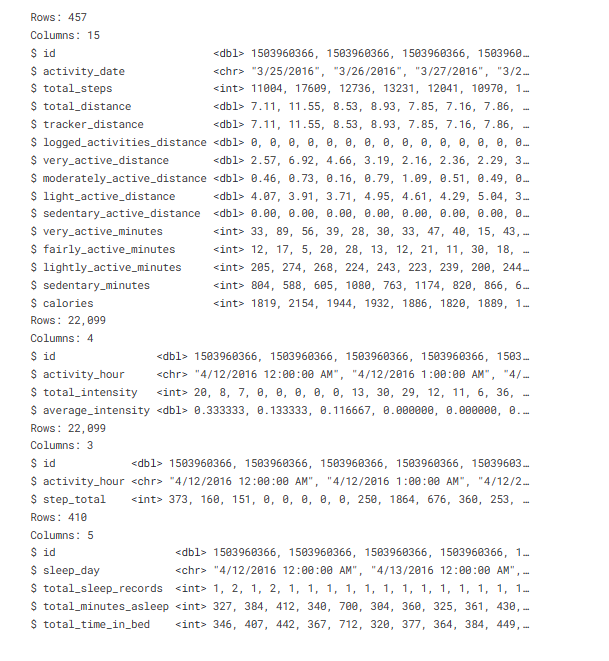

#### BELLABEAT CASESTUDY ANALYSIS IN R
##### Project Summary
The BellaBeat casestudy focuses on the usage of the smart device that are avaible in the market. The insights from this analysis will help guide marketing strategy for the Bellabeat company.
    
##### About the company
     
BellaBeat is  a high-tech company that was found in the year 2013, manufactures health-focused smart products for women around the world. They design technologies that informs and inspires women. Since it was founded in 2013, Bellabeat has grown rapidly and quickly positioned itself as a tech-driven wellness company for women. By 2016, Bellabeat had expanded their growth around the world and launched multiple products.Their Products became available through several online retailers and through their own website.They even utilized the  scope of traditional advertising, to create more awareness and expand their business. Maintaining active facebook and Instagram pages and engaging with the consumers on Twitter has shown their consistent action towards women’s empowerment.Additionally, Bellabeat runs video ads on Youtube and display ads on the Google Display Network to support campaigns around key marketing dates.
     
##### Summary of Business Task
  Bellabeat has several smart products available in the market for women to track their health,fitness, sleep,stress and nutrition information.Now, Analysing how a consumer uses a smart device tracker that is available in the market can give an opportunity to discover several insights and trends about the customer. 
1.Analysing the smart fitness tracker data and finding trends and insights of consumer’s usage habits.
2.Knowing how the tracker impacted on consumers lifestyle can reveal many possibilities in the marketing strategy.

##### Datasource Used

This dataset generated by respondents to a distributed survey via Amazon Mechanical Turk between 03.12.2016-05.12.2016. Thirty eligible Fitbit users consented to the submission of personal tracker data, including minute-level output for physical activity, heart rate, and sleep monitoring. Individual reports can be parsed by export session ID (column A) or timestamp (column B). Variation between output represents use of different types of Fitbit trackers and individual tracking behaviors / preferences.Below it the link for the dataset.

[Please Click here to go to Dataset](https://www.kaggle.com/datasets/arashnic/fitbit)

##### Dataset
The fitness dataset has 18 files in csv format. It consists of the daily metrics,hourly metrics,sleep log and weight log.This consists of the details of 33 users and their usage of smart device to track their activities.

##### Loading Packages

Attaching package: ‘janitor’

The following objects are masked from ‘package:stats’:
 chisq.test, fisher.test

##### Importing the dataset

All of the 18 files have been imported and studied before proceeding further analysis.

##### Studying the Dataset

1.It is observed that the daily_activity,daily_intensities,daily_calories
and daily_steps shows the daily metrics of the users.

2.HourlyIntensities,hourlySteps,hourly_calories includes the hourly metrics of the users.

3.Minute_intensities,minute_calories,minute_steps shows the minute metrics of the users. This has both long and wide format.

4.SleepDay,heartrate_seconds,weight_log_info mentions about the sleeping
patterns,heart rate and weight informations about the users. So let's consider daily_activity,hourly_intensities,hourly_steps and
sleep_day for our analysis in this project.

##### Data considered for analysis in this project:

daily_activity      
hourly_intensities   
hourly_steps   
sleep_day

#### Usind head(),we can view the first few rows of the data frame.And using str(), the structure of the data frame can be seen.

   

   

   

   

   

##### Limitations:

1.The data shows results of 33 users and with a very short time frame of only two months from 12th April,2016 to 12th May,2016.

2.Out of the 33 users, few users were not an active tracker.

3.Data card states that differences between outputs are due to
different types of Fitbit trackers being used to track the
data and differences in individual tracking behaviours.

4.There is no information about the users age,gender,health
status or work routine.

Now Let's do some cleaning work with our data. Checking the distinct,null and duplicate values and then removing them if needed. Cleaning the column names and converting the datatype to correct format.
  
##### Checking for Distinct Values

n_distinct(daily_activity$Id)   
n_distinct(daily_intensities$Id)   
n_distinct(daily_calories$Id)   
n_distinct(daily_steps$Id)   
n_distinct(hourly_intensities$Id)   
n_distinct(hourly_steps$Id)   
n_distinct(sleep_day$Id)   

35   
33   
33   
33   
33   
33   
24   

##### Checking for Duplicate values

sum(duplicated(daily_activity))   
sum(duplicated(hourly_intensities))   
sum(duplicated(hourly_steps))   
sum(duplicated(sleep_day))   
0   
0   
0   
3   

##### Removing Duplicate Values

##### Cleaning the column names

daily_activity <- clean_names(daily_activity) %>% glimpse
hourly_intensities <- clean_names(hourly_intensities) %>% glimpse
hourly_steps <- clean_names(hourly_steps) %>% glimpse
sleep_day <- clean_names(sleep_day) %>% glimpse

##### Changing the column names for easier analysis

colnames(hourly_steps)[2] = "activity_date"   
colnames(hourly_intensities)[2] = "activity_date"   
colnames(sleep_day)[2] = "activity_date"   

##### Checking for correct datatype

It was found that the date and time column in the dataframe is in charater format.So converting it to the correct format.

##### converting activity_date to date format
daily_activity$activity_date <- as.POSIXct(daily_activity$activity_date, format = "%m/%d/%Y")   
daily_activity <- daily_activity %>%    
  mutate(activity_date = as.Date(activity_date))   
str(daily_activity)

hourly_steps$activity_date <- as.POSIXct(hourly_steps$activity_date, format = "%m/%d/%Y %I:%M:%S %p" , tz=Sys.timezone())   
str(hourly_steps)

##### 'data.frame':	22099 obs. of  3 variables:
 $ id           : num  1.5e+09 1.5e+09 1.5e+09 1.5e+09 1.5e+09 ...   
 $ activity_date: POSIXct, format: "2016-04-12 00:00:00" "2016-04-12 01:00:00" ...   
 $ step_total   : int  373 160 151 0 0 0 0 0 250 1864 ...   

hourly_intensities$activity_date <- as.POSIXct(hourly_intensities$activity_date, format = "%m/%d/%Y %I:%M:%S %p" , tz=Sys.timezone())      
str(hourly_intensities)

##### 'data.frame':	22099 obs. of  4 variables:
 $ id               : num  1.5e+09 1.5e+09 1.5e+09 1.5e+09 1.5e+09 ...   
 $ activity_date    : POSIXct, format: "2016-04-12 00:00:00" "2016-04-12 01:00:00" ...   
 $ total_intensity  : int  20 8 7 0 0 0 0 0 13 30 ...   
 $ average_intensity: num  0.333 0.133 0.117 0 0 ...   

sleep_day$activity_date <- as.POSIXct(sleep_day$activity_date, format = "%m/%d/%Y %I:%M:%S %p")   
sleep_day$activity_date <- as_date(sleep_day$activity_date )
str(sleep_day)   

##### 'data.frame':	410 obs. of  5 variables:
 $ id                  : num  1.5e+09 1.5e+09 1.5e+09 1.5e+09 1.5e+09 ...   
 $ activity_date       : Date, format: "2016-04-12" "2016-04-13" ...   
 $ total_sleep_records : int  1 2 1 2 1 1 1 1 1 1 ...   
 $ total_minutes_asleep: int  327 384 412 340 700 304 360 325 361 430 ...   
 $ total_time_in_bed   : int  346 407 442 367 712 320 377 364 384 449 ...   

##### Summarizing the distance

           
##### Summarizing the minutes

The above summary shows that the average of lightly_active_minutes is more than the average of very_active_minutes and lightly_active_minutes. From this we can be informed that most of the users are leading a very lightly active lifestyle.

##### Summarizing totalsteps and calories

 

##### Average Steps,Calories and Distance of the Users

##### 1.Plotting a graph between Average Steps per hour by the users
##### Extracting hours and minutes from the activity_date column from hourly_steps dataframe

hourly_steps$activity_hour = format(as.POSIXct(hourly_steps$activity_date,format="%m%d%Y %H:%M:%S"),"%H:%M")
##### Summarizing Average Steps

AvgSteps<-hourly_steps %>%group_by(activity_hour)%>%   
  drop_na()%>%   
  summarise( AvgSteps = mean(step_total))%>%view   

##### 2.Plotting a graph between Average intensities and hours
##### Separating the hours into another column as activity_hour

hourly_intensities$activity_hour = format(as.POSIXct(hourly_intensities$activity_date,format = "%m/%d/%Y %I:%M:%S %p"),"%H:%M")%>%view

##### Average Intensity Per Hour

AvgIntensity  <-hourly_intensities %>%group_by(activity_hour)%>%  
  drop_na()%>%  
  summarise( AvgIntensity = mean(total_intensity))%>%view

##### Findings

From the above plot we can find that the average intensity is more during the hours 5pm - 7pm. So sending notifications in the time other than peak hours would remind the users to stay on their fitness goal.

##### 3.Plotting a graph between TotalSteps and Calories

##### Findings

From the above graph the TotalSteps is proportional to the calories burnt. The more number of steps the user has taken , the more calories they have burnt.

##### 4.Plotting a graph to show users sleep pattern
##### Average Sleep Minutes of the users

sleep_day %>%
  summarise( AvgSleepMinutes = mean(total_minutes_asleep))%>%glimpse
Rows: 1   
Columns: 1   
$ AvgSleepMinutes <dbl> 419.1732   

##### Findings

From the above plot it is understood that most of the users sleep atleast for 400 to 460 minutes which is approximately 7 hours.

##### 5.Plot a graph between days of the week vs total active minutes

Extracting days from the activity_date column of daily_activity data frame and putting into a seperate column dayoyweek.

Then summing up very active minutes,fairly active minutes and the lightly active minutes to get the total active minutes

##### merging daily_activity and sleep_day data frame for further analysis   

merged_data <-merge(sleep_day, daily_activity, by= c('id','activity_date'))   
head(merged_data)

##### Conclusion

1.From the graph average steps per day,it can be studied that the number of steps are gradually increasing during the day time after 10am and maximum from 5pm - 7pm. This shows that the users are more active during the time 5 pm - 7 pm.

2.Similarly the graph average intensities shows that the intensity is more from 5pm - 7pm.So considering this fact, Bellabeat company can send a reminder to the users during other times of the day to stay active.This can be a light movement break,small walk,some chair exercises if they have a sedentary job style.

3.When studying the visual to analyse the sleep patterns, it is understood that most of the users sleep atleast for 400 to 460 minutes which is approximately 7 hours.

4.From the graph between Week of day vs active minutes,it can be concluded that the users are more active on tuesdays,wednesday and thursday during the week and least active on sundays.

5.We have also plotted a graph showing the realationship between the sedentary minutes and the Time asleep.This particular plot shows that the Time asleep increases when the sedentary minutes decreases.
