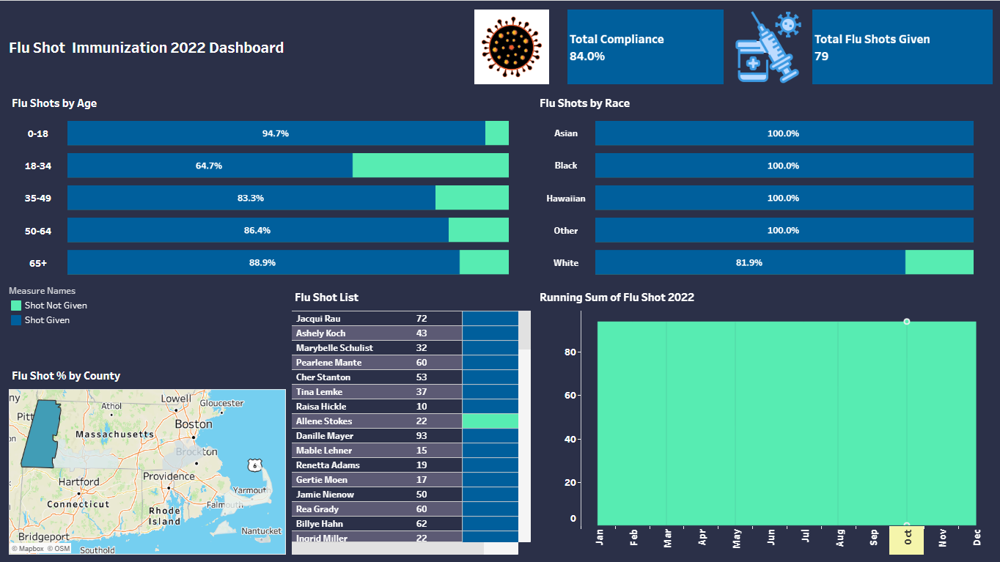

### FLUSHOT ANALYSIS

#### Project Summary
The purpose of this project is to identify the key performance metrics involed in the Flu Shot Vaccination for the year 2022.Our goal is to find the total percentage of people who received their flushot which was stratified based on their gender, race and region(county). This is acheived using SQL (data extraction) and Tableau (for visualisation).

### Dataset
This project uses synthetically generated data for the analysis from an open source called Synthea. Synthea is an open-source, synthetic patient generator that models the medical history of synthetic patients.Imported the csv files into PostgreSQL.And the size of the dataset was approximately 400000 records for each table.It consists of the patients,immunizations,condition and encounters details.
### Studying the Dataset
1.It is observed that the patients table includes details as name,SSN,Id, Birthdate,Address,Income,Healthcare expenses,Healthcare Coverage and so on.
2.Conditions includes details about the health condition of the patients.
3.Encounters include details like Encounterclass,provider,payer etc.
4.Immunizations include details like patient ID,encounter,description,code etc.
### SQL Query
After Understanding the data,used to write a query to retrieve the patients that are active , age greater than 6 months and received flushot in the year 2022.Then pulled the data out of postgreSQL and imported in Tableau for further analysis and visualization.
### Data Transformation
Created Calculated fields to group the patients based on age and find the percentage of patients who received the flushot in a particular age range.
Created Calculated fields to group the patients based on race and find the percentage of patients who received the flushot from a particular race.
Created Calculated fields to group the patients based on county and find the percentage of patients who received the flushot from a particular county.
### Visualization
Created Dashboard that consists of bar charts and maps to visualize the percentage of patients received flushot based on age,gender and county.
Developed area chart to visualize the running sum of FluShot in the year 2022.
### FluShot Insights
The percentage of patients who received the flushot is low among the age range 18-49 compared to the other age groups. 50-64 being the highest.
The most number of patients that received flushot is from the race native.

